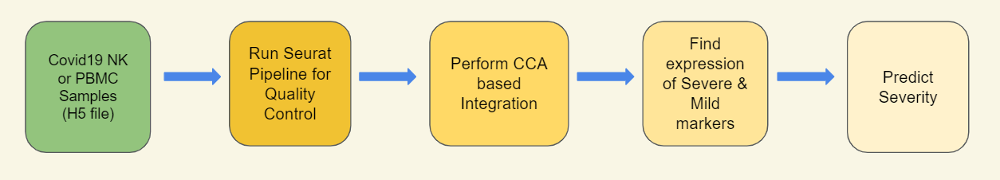
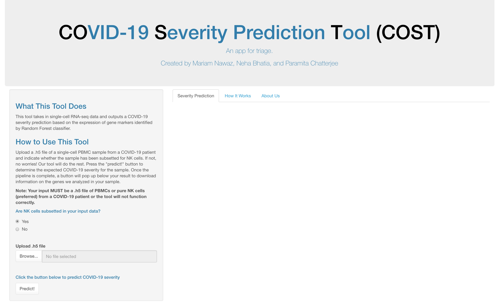
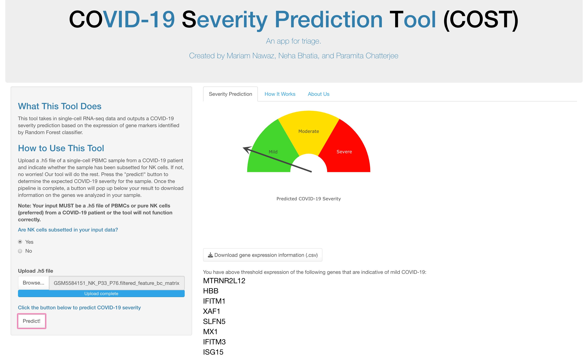

# **COST** - A *CO*VID-19 *S*EVERITY PREDICTION *T*OOL
## 
(COVID-19 Triage Tool)
  

### ***By Mariam Nawaz, Neharika Bhatia, Paramita Chatterjee***  

### **Introduction**
Acute SARS-CoV-2 infection affects the number of circulating Natural Killer (NK) cells and their phenotype. NK cells dysfunction has been observed in COVID-19 patients with high levels of cytotoxic proteins in NK cells in Severe COVID-19 cases.

Here, we created a workflow to predict COVID-19 disease severity based on NK cell transcriptome expression profiles of Single-cell RNA-seq data from pure NK cells or Peripheral Blood Mononuclear Cells (PBMCs). We followed the [SEURAT](https://github.com/satijalab/seurat) workflows for the analysis. The input file is a **H5 matrix**, and the output is a **COVID-19 Severity Prediction** and **.csv** file with detailed marker expression information. 

### **How to use the app**
Go to the [COST](https://genapp2022.biosci.gatech.edu/team7/), read the instructions, upload your data, press *Predict*.

### **Developers**
* [Mariam Nawaz](https://github.com/mariamnawaz1) 
* [Neharika Bhatia](https://github.com/nehabhatia8) 
* [Paramita Chatterjee](https://github.com/pchatterjee7) 
